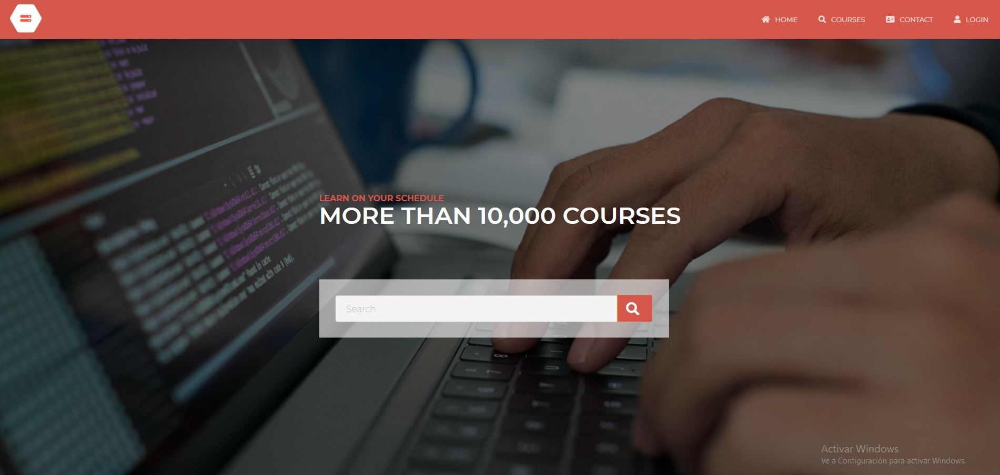
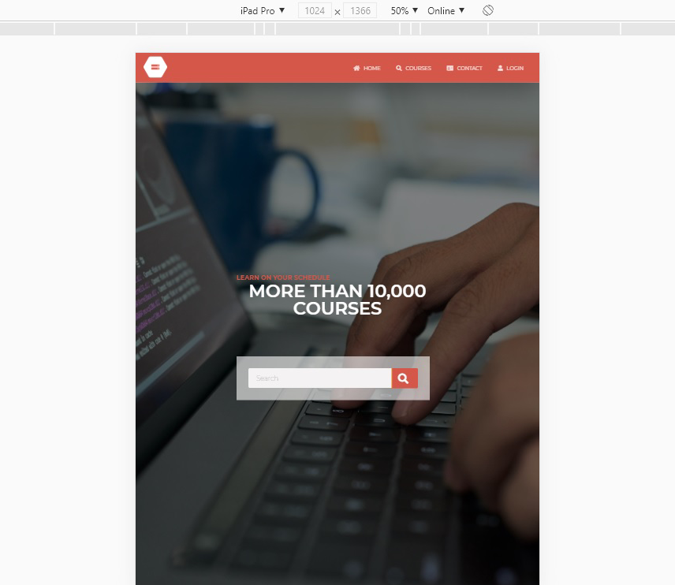

#  🧐 Directory of Schools

This is the HTML and CSS capstone (solo project) from the Microverse program, It's a complete responsive layout adaptation of "Directory of Schools" in my case is a page about boot camps and online courses called "Academy", it's built on HTML and CSS3 languages with the help 
of Sass a CSS preprocessor (.scss extension).

## 🔧 Built With

- HTML and CSS3.
- Using UX.
- Using floats and flexbox.
- Using StyleLinters.
- W3 HTML Validation Service.

## 🔴 Live Demo

[Live Demo Link]()

## 🛠 Getting Started

To get a local copy up and running follow these simple example steps.

- Go to the main page of te repo.
- Press the "Code" button and get the repo link.
- Clone it using git.

## ✒️ Author

👤 **Cecilia Benitez**

- Github: [@Ceci007](https://github.com/Ceci007)
- LinkenIn:[LinkenIn](https://www.linkedin.com/in/cecilia-ben%C3%ADtez-casaccia-498669185/)

## 🤝 Contributing

Contributions, issues and feature requests are welcome!

Feel free to check the [issues page](issues/).

## 📝 License

This project is [MIT](lic.url) licensed.
